# LibreCudaISP

[](LICENSE)


**A CUDA C++ camera image signal processor for converting Bayer RAW sensor
captures into RGB images on NVIDIA GPUs.**

LibreCudaISP is a readable, GPU-native ISP implementation for camera algorithm
development, RAW image processing experiments, and CUDA performance work. It
supports MIPI RAW10 and unpacked RAW, all four common Bayer patterns, automatic
white balance, demosaicing, color correction, tone mapping, denoising, and
per-stage timing.

## Pipeline



The colored groups mark the Bayer, RGB, and YUV processing domains. Dark blocks
are pixel-format or color-space transitions.

## Quick start

You need an NVIDIA GPU, CUDA Toolkit 11+, CMake 3.25+, a C++17 compiler, and
network access during the first build.

```bash
git clone https://github.com/xgu20/LibreCudaISP.git
cd LibreCudaISP

python3 -m pip install PyYAML
python3 tools/download_data.py infinite

cmake -S . -B build -DCMAKE_BUILD_TYPE=Release
cmake --build build -j

./build/libreisp \
  data/infinite/Indoor1_2592x1536_10bit_GRBG.raw \
  output.png
```

The data command downloads the tuned 10-bit sample set and creates matching
JSON sidecars. The processed image is written to `output.png`.

## Sample output

These images were generated by LibreCudaISP from the 10-bit samples published
by 10x Engineers, using Gray World AWB and the matching upstream color
correction matrices. The corresponding reference renders are available in the
[Infinite-ISP assets](https://github.com/10x-Engineers/Infinite-ISP/tree/main/assets).
Click any image to view the LibreCudaISP output at full resolution.

<p align="center">
  <a href="docs/assets/infinite/Indoor1.png"></a>
  <a href="docs/assets/infinite/Outdoor1.png"></a>
  <a href="docs/assets/infinite/Outdoor2.png"></a>
  <a href="docs/assets/infinite/Outdoor3.png"></a>
  <a href="docs/assets/infinite/Outdoor4.png"></a>
</p>

Compare with the upstream Infinite-ISP reference outputs:
[Indoor1](https://github.com/10x-Engineers/Infinite-ISP/blob/main/assets/Indoor1.png),
[Outdoor1](https://github.com/10x-Engineers/Infinite-ISP/blob/main/assets/Outdoor1.png),
[Outdoor2](https://github.com/10x-Engineers/Infinite-ISP/blob/main/assets/Outdoor2.png),
[Outdoor3](https://github.com/10x-Engineers/Infinite-ISP/blob/main/assets/Outdoor3.png), and
[Outdoor4](https://github.com/10x-Engineers/Infinite-ISP/blob/main/assets/Outdoor4.png).
[Browse all upstream assets](https://github.com/10x-Engineers/Infinite-ISP/tree/main/assets).

## Data and tuning

RAW datasets are downloaded separately and are not committed to this repository.

```bash
# Public Infinite-ISP RAW10 samples and matching tuning files
python3 tools/download_data.py infinite

# Kaggle data (requires Kaggle credentials and optional dependencies)
python3 -m pip install -r requirements-data.txt
python3 tools/download_data.py kaggle

# Download both sources
python3 tools/download_data.py all
```

The Infinite-ISP downloader fetches the upstream YAML tuning files and generates
the JSON sidecars used by LibreCudaISP. Kaggle captures may need dataset-specific
conversion and sidecar generation. See [data/README.md](data/README.md) for data
sources, authentication, directory layout, and tuning conversion.

## Process your own RAW capture

Place a JSON sidecar next to the RAW file with the same stem:

```text
data/example.raw
data/example.json
```

Then run:

```bash
./build/libreisp data/example.raw output.png
```

[config/golden_tuning.json](config/golden_tuning.json) provides generic defaults;
the sidecar supplies sensor- and capture-specific values. The sidecar schema and
conversion tools are documented in [data/README.md](data/README.md).

## Documentation

- [Data download, tuning, and sidecars](data/README.md)
- [Testing and benchmarking](docs/testing.md)
- [YUV denoise algorithm](docs/algorithms/yuv_denoise.md)
- [Chroma-noise troubleshooting](docs/troubleshooting/chroma_noise_on_green_screen.md)
- [Roadmap](TODO.md)

## Contributing

Issues and pull requests are welcome. Before submitting a change, build the
project and follow the [testing guide](docs/testing.md). C++ and CUDA formatting
follows the repository's `.clang-format` file.

## License

LibreCudaISP is available under the [MIT License](LICENSE). Third-party
components remain subject to their own licenses. CUDA is a trademark of NVIDIA
Corporation; LibreCudaISP is an independent project and is not affiliated with
or endorsed by NVIDIA.
